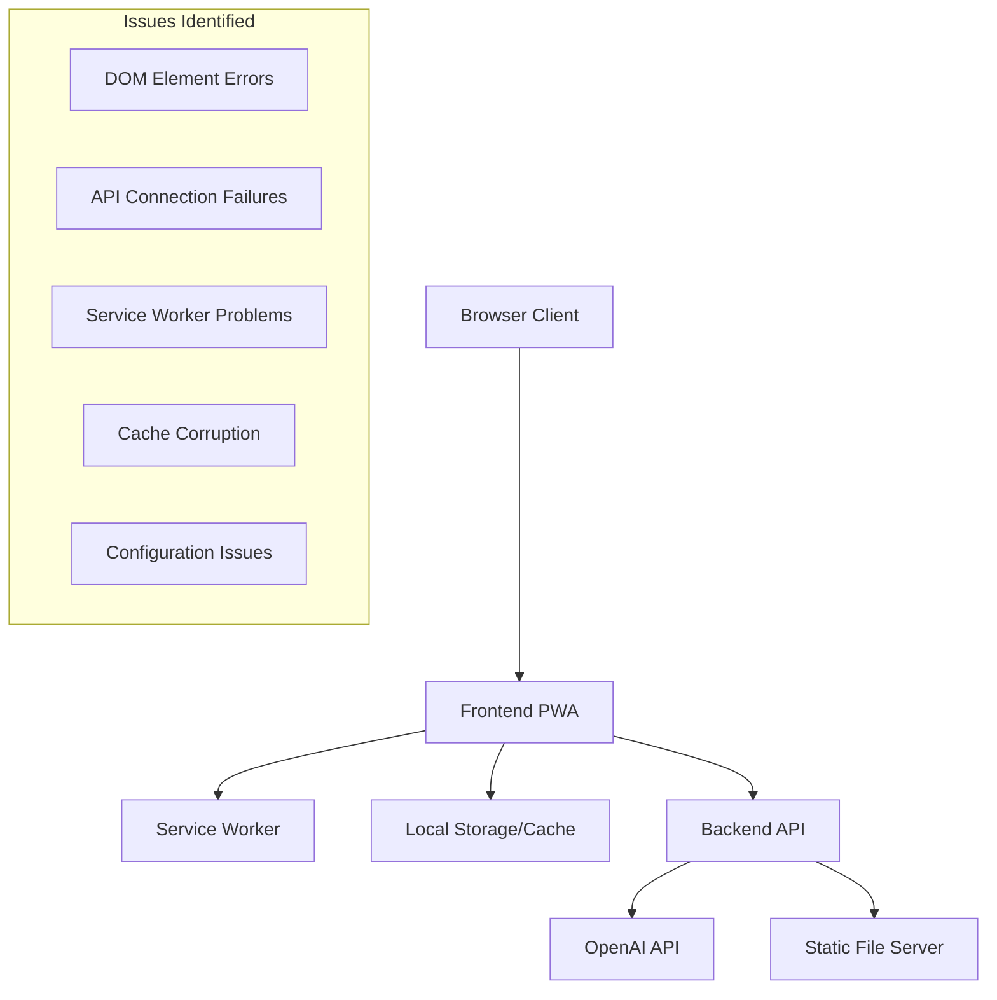
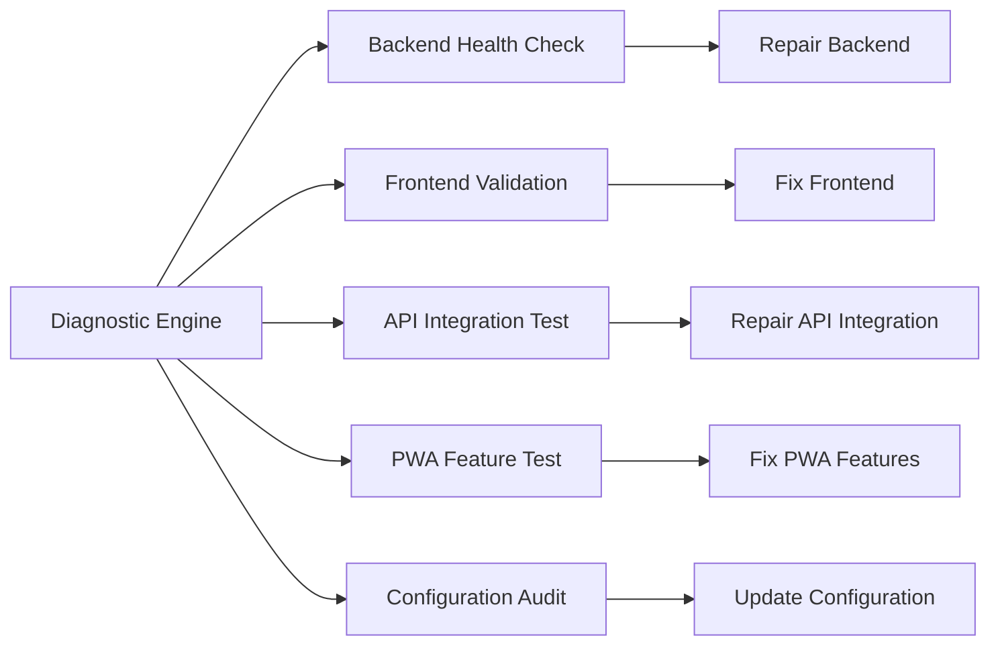

# Design Document

## Overview

This design document outlines a systematic approach to diagnose and fix all critical issues in the KIRO Digital Calendar application. The application appears to have comprehensive functionality documented but suffers from widespread implementation problems across multiple layers. Our approach will be to implement a diagnostic-first methodology, identifying root causes before applying targeted fixes.

The repair strategy follows a dependency-based approach: fix foundational issues first (backend, configuration), then build up through the application layers (frontend, API integration, PWA features). Each fix will be validated before proceeding to dependent components.

## Architecture

### Current Architecture Analysis

The KIRO application follows a client-server architecture:



### Diagnostic Architecture

We'll implement a systematic diagnostic system that can identify and report issues across all application layers:



## Components and Interfaces

### 1. Diagnostic Engine

**Purpose**: Systematically identify all issues across the application stack

**Interface**:
```javascript
class DiagnosticEngine {
    async runFullDiagnostic()
    async testBackendHealth()
    async validateFrontendElements()
    async testAPIIntegration()
    async checkPWAFeatures()
    async auditConfiguration()
    generateDiagnosticReport()
}
```

**Key Functions**:
- Automated testing of all application components
- Detailed error reporting with root cause analysis
- Dependency mapping to identify fix order
- Progress tracking for repair operations

### 2. Backend Repair Module

**Purpose**: Fix server startup, API endpoints, and backend functionality

**Interface**:
```javascript
class BackendRepair {
    async fixServerStartup()
    async repairAPIEndpoints()
    async validateEnvironmentConfig()
    async testDatabaseConnections()
    async fixStaticFileServing()
}
```

**Key Functions**:
- Server configuration validation and repair
- API endpoint testing and fixing
- Environment variable validation
- Static file serving configuration
- Error handling implementation

### 3. Frontend Repair Module

**Purpose**: Fix UI loading, DOM element issues, and JavaScript errors

**Interface**:
```javascript
class FrontendRepair {
    async validateDOMElements()
    async fixJavaScriptErrors()
    async repairEventListeners()
    async fixNavigationSystem()
    async validateCSSStyling()
}
```

**Key Functions**:
- DOM element existence validation
- JavaScript error identification and fixing
- Event listener repair and validation
- Navigation system debugging
- CSS and styling issue resolution

### 4. API Integration Repair Module

**Purpose**: Fix OpenAI integration and external API connections

**Interface**:
```javascript
class APIIntegrationRepair {
    async validateOpenAIConfig()
    async testAPIConnectivity()
    async fixQuoteGeneration()
    async repairErrorHandling()
    async validateResponseParsing()
}
```

**Key Functions**:
- OpenAI API key validation and testing
- Network connectivity testing
- Quote generation pipeline repair
- API error handling implementation
- Response parsing and validation

### 5. PWA Feature Repair Module

**Purpose**: Fix Progressive Web App features and offline functionality

**Interface**:
```javascript
class PWARepair {
    async fixServiceWorker()
    async repairCacheStrategy()
    async validateManifest()
    async fixInstallPrompt()
    async testOfflineMode()
}
```

**Key Functions**:
- Service worker registration and functionality
- Cache strategy implementation and testing
- Web app manifest validation
- Install prompt functionality
- Offline mode testing and repair

## Data Models

### Diagnostic Report Model

```javascript
const DiagnosticReport = {
    timestamp: Date,
    overallStatus: 'healthy' | 'issues' | 'critical',
    components: {
        backend: ComponentStatus,
        frontend: ComponentStatus,
        apiIntegration: ComponentStatus,
        pwaFeatures: ComponentStatus,
        configuration: ComponentStatus
    },
    issues: [Issue],
    recommendations: [Recommendation],
    repairPlan: RepairPlan
}

const ComponentStatus = {
    name: String,
    status: 'healthy' | 'warning' | 'error',
    tests: [TestResult],
    issues: [Issue],
    dependencies: [String]
}

const Issue = {
    id: String,
    severity: 'low' | 'medium' | 'high' | 'critical',
    component: String,
    description: String,
    rootCause: String,
    solution: String,
    dependencies: [String]
}
```

### Repair Plan Model

```javascript
const RepairPlan = {
    phases: [RepairPhase],
    estimatedTime: Number,
    riskLevel: 'low' | 'medium' | 'high',
    backupRequired: Boolean
}

const RepairPhase = {
    name: String,
    order: Number,
    tasks: [RepairTask],
    dependencies: [String],
    validationTests: [String]
}

const RepairTask = {
    id: String,
    description: String,
    component: String,
    action: 'fix' | 'replace' | 'configure' | 'validate',
    files: [String],
    commands: [String],
    validationCriteria: [String]
}
```

## Correctness Properties

*A property is a characteristic or behavior that should hold true across all valid executions of a system-essentially, a formal statement about what the system should do. Properties serve as the bridge between human-readable specifications and machine-verifiable correctness guarantees.*

<function_calls>
<invoke name="prework">
<parameter name="featureName">kiro-application-fixes

### Property Reflection

After analyzing all acceptance criteria, I identified several areas where properties can be consolidated:

**Redundancy Analysis:**
- Properties 1.1-1.5 (Backend functionality) can be combined into comprehensive backend health properties
- Properties 2.2-2.5 (Frontend validation) overlap and can be consolidated into DOM and initialization properties  
- Properties 3.1-3.5 (Quote system) can be streamlined into core quote functionality properties
- Properties 4.1-4.5 (OpenAI integration) can be combined into API integration and error handling properties
- Properties 5.2-5.4 (User profile) have overlapping persistence and loading concerns
- Properties 6.1-6.5 (PWA features) can be consolidated into installation and offline functionality properties
- Properties 7.1-7.5 (Error handling) can be combined into comprehensive error management properties
- Properties 8.1-8.5 (Caching) can be streamlined into cache operations and recovery properties

**Consolidated Properties:**

Property 1: Backend Server Health
*For any* server startup attempt, the backend should successfully start, respond to health checks, serve static files, and handle errors gracefully while continuing operation
**Validates: Requirements 1.1, 1.2, 1.4, 1.5**

Property 2: Frontend Application Initialization  
*For any* application load, the frontend should find all required DOM elements, complete initialization without errors, and enable proper navigation between views
**Validates: Requirements 2.2, 2.3, 2.4, 2.5**

Property 3: API Response Validity
*For any* API endpoint call, the backend should return valid JSON responses with correct status codes and proper error handling
**Validates: Requirements 1.3, 7.2**

Property 4: Quote System Functionality
*For any* quote operation (display, feedback, archive), the system should handle the operation correctly with proper loading states and error recovery
**Validates: Requirements 3.1, 3.3, 3.4, 3.5**

Property 5: Offline Quote Availability
*For any* offline scenario, the quote system should display cached quotes or appropriate fallback content
**Validates: Requirements 3.2, 6.3**

Property 6: OpenAI Integration Reliability
*For any* AI quote generation request, the system should either successfully generate a German quote or gracefully handle failures with fallback content
**Validates: Requirements 4.1, 4.2, 4.3, 4.4**

Property 7: User Profile Persistence
*For any* profile operation (create, update, load), the system should persist data correctly and handle corruption gracefully
**Validates: Requirements 5.2, 5.3, 5.4, 5.5**

Property 8: PWA Installation and Offline Functionality
*For any* PWA-capable browser, the application should offer installation and function correctly offline with proper service worker caching
**Validates: Requirements 6.1, 6.2, 6.4, 6.5**

Property 9: Comprehensive Error Handling
*For any* error condition (frontend, API, critical), the system should log detailed information, provide user-friendly messages, and offer recovery options
**Validates: Requirements 7.1, 7.3, 7.5**

Property 10: Cache Management and Recovery
*For any* caching operation, the system should store data correctly, manage storage limits, and recover from corruption
**Validates: Requirements 8.1, 8.2, 8.4, 8.5**

Property 11: Configuration Validation and Application
*For any* configuration setting, the system should validate, apply, and report missing or invalid configuration appropriately
**Validates: Requirements 10.1, 10.2, 10.3, 10.4**

Property 12: Performance Requirements
*For any* normal application startup, initialization should complete within 3 seconds and API calls should implement proper timeouts and retries
**Validates: Requirements 9.1, 9.2**

## Error Handling

### Error Classification System

**Critical Errors** (Application cannot function):
- Server fails to start
- Complete frontend failure to load
- All API endpoints non-functional
- Service worker registration failure

**High Priority Errors** (Major features broken):
- OpenAI integration completely broken
- Quote system non-functional
- User profile system failure
- PWA installation broken

**Medium Priority Errors** (Some features impacted):
- Individual API endpoints failing
- Specific UI components not working
- Cache corruption issues
- Configuration validation problems

**Low Priority Errors** (Minor issues):
- Styling inconsistencies
- Non-critical logging issues
- Performance optimizations needed
- Documentation gaps

### Error Recovery Strategy

1. **Graceful Degradation**: When components fail, provide fallback functionality
2. **User Communication**: Clear, actionable error messages for users
3. **Developer Diagnostics**: Detailed logging and diagnostic information
4. **Automatic Recovery**: Self-healing mechanisms where possible
5. **Manual Recovery**: Clear instructions for manual intervention when needed

### Error Handling Implementation

```javascript
class ErrorHandler {
    static handleCriticalError(error, component) {
        // Log detailed error information
        console.error(`CRITICAL ERROR in ${component}:`, error);
        
        // Attempt automatic recovery
        const recovered = this.attemptAutoRecovery(component, error);
        
        if (!recovered) {
            // Show user-friendly error message with recovery options
            this.showUserError(component, error);
            
            // Provide diagnostic information
            this.generateDiagnosticReport(component, error);
        }
    }
    
    static attemptAutoRecovery(component, error) {
        // Component-specific recovery strategies
        switch (component) {
            case 'backend':
                return this.recoverBackend(error);
            case 'frontend':
                return this.recoverFrontend(error);
            case 'api':
                return this.recoverAPI(error);
            default:
                return false;
        }
    }
}
```

## Testing Strategy

### Dual Testing Approach

The testing strategy combines unit tests for specific functionality with property-based tests for comprehensive validation:

**Unit Tests**: Focus on specific examples, edge cases, and error conditions
- Individual component functionality
- Specific error scenarios
- Integration points between components
- Configuration validation

**Property Tests**: Verify universal properties across all inputs
- System-wide behavior validation
- Comprehensive input coverage through randomization
- Cross-component interaction testing
- End-to-end workflow validation

### Property-Based Testing Configuration

- **Testing Library**: Jest with fast-check for property-based testing
- **Minimum Iterations**: 100 iterations per property test
- **Test Tagging**: Each property test references its design document property
- **Tag Format**: **Feature: kiro-application-fixes, Property {number}: {property_text}**

### Testing Implementation Strategy

1. **Diagnostic Tests**: Automated tests that identify current issues
2. **Repair Validation Tests**: Tests that verify fixes are working
3. **Regression Tests**: Tests that ensure fixes don't break other functionality
4. **Integration Tests**: Tests that verify component interactions
5. **End-to-End Tests**: Tests that validate complete user workflows

### Test Categories

**Backend Testing**:
- Server startup and shutdown
- API endpoint functionality
- Error handling and recovery
- Configuration validation
- Static file serving

**Frontend Testing**:
- DOM element validation
- JavaScript error detection
- Event listener functionality
- Navigation system testing
- UI component rendering

**Integration Testing**:
- API communication
- Data flow between components
- Error propagation and handling
- Cache synchronization
- PWA feature integration

**End-to-End Testing**:
- Complete user workflows
- Offline/online transitions
- Installation and usage scenarios
- Performance and reliability testing
- Cross-browser compatibility

### Continuous Validation

The repair process includes continuous validation to ensure:
- Each fix resolves the intended issue
- Fixes don't introduce new problems
- System stability is maintained throughout the repair process
- All dependencies are properly handled
- Performance is not degraded by repairs

This comprehensive testing strategy ensures that the KIRO application will be thoroughly validated at every step of the repair process, providing confidence that all issues are properly resolved and the application functions reliably across all supported scenarios.