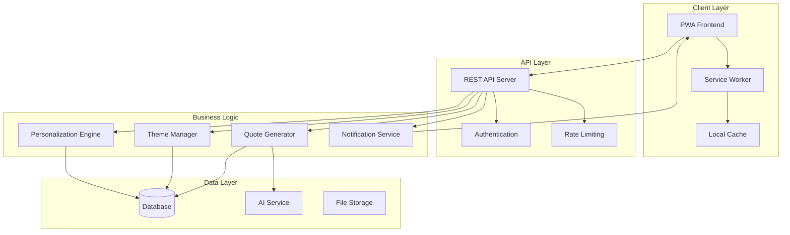

# Design Document: ARK Digital Calendar

## Overview

ARK is a Progressive Web Application (PWA) that delivers personalized, AI-generated daily quotes through a clean, mobile-first interface. The system combines modern web technologies with AI-powered personalization to create a meaningful daily ritual for users.

The architecture follows a client-server model with offline-first capabilities, ensuring users can access their content regardless of connectivity. The system learns from user feedback to continuously improve personalization while maintaining simplicity and focus.

## Architecture



## Components and Interfaces

### Frontend Components

**Main Application (PWA)**
- **Daily Quote View**: Primary interface displaying current day's quote
- **Archive Browser**: Historical quote browsing with search and filtering
- **Profile Setup**: Initial questionnaire and preference management
- **Settings Panel**: Notification preferences and account management
- **Feedback Interface**: Like/neutral/dislike rating system

**Service Worker**
- **Caching Strategy**: Cache-first for static assets, network-first for dynamic content
- **Background Sync**: Queue user feedback and profile updates when offline
- **Push Notifications**: Handle incoming daily reminders

### Backend Services

**Quote Generator Service**
```typescript
interface QuoteGenerator {
  generateDailyQuote(userId: string, date: Date): Promise<Quote>
  validateQuoteUniqueness(userId: string, content: string): Promise<boolean>
  getThemeContext(date: Date): Promise<ThemeContext>
}
```

**Personalization Engine**
```typescript
interface PersonalizationEngine {
  createUserProfile(responses: QuestionnaireResponse[]): Promise<UserProfile>
  updateProfile(userId: string, feedback: Feedback): Promise<void>
  getPersonalizationContext(userId: string): Promise<PersonalizationContext>
  adaptToFeedback(userId: string, feedbackHistory: Feedback[]): Promise<void>
}
```

**Theme Manager**
```typescript
interface ThemeManager {
  getCurrentTheme(date: Date): Promise<Theme>
  getMonthlyThemes(year: number): Promise<Theme[]>
  getWeeklySubThemes(monthTheme: Theme): Promise<SubTheme[]>
}
```

**Notification Service**
```typescript
interface NotificationService {
  scheduleDaily(userId: string, preferences: NotificationPrefs): Promise<void>
  sendNotification(userId: string, quote: Quote): Promise<void>
  updateSchedule(userId: string, newPrefs: NotificationPrefs): Promise<void>
}
```

### API Endpoints

**Quote Management**
- `GET /api/quotes/today` - Get current day's quote
- `GET /api/quotes/archive` - Get user's quote history
- `POST /api/quotes/feedback` - Submit quote feedback
- `GET /api/quotes/search?q={query}` - Search archived quotes

**User Management**
- `POST /api/users/profile` - Create initial user profile
- `PUT /api/users/profile` - Update user preferences
- `GET /api/users/profile` - Get current user profile
- `POST /api/users/sync` - Synchronize offline data

**Theme and Content**
- `GET /api/themes/current` - Get current theme information
- `GET /api/themes/calendar` - Get theme calendar for year

## Data Models

### Core Entities

**User Profile**
```typescript
interface UserProfile {
  id: string
  createdAt: Date
  updatedAt: Date
  personalityCategories: PersonalityCategory[]
  preferences: UserPreferences
  feedbackHistory: Feedback[]
  notificationSettings: NotificationSettings
}

interface PersonalityCategory {
  category: 'spirituality' | 'sport' | 'education' | 'health' | 'humor' | 'philosophy'
  weight: number // 0.0 to 1.0
  confidence: number // How confident we are in this assessment
}
```

**Daily Quote**
```typescript
interface Quote {
  id: string
  userId: string
  content: string
  author?: string
  date: Date
  theme: Theme
  personalizedFor: PersonalizationContext
  feedback?: Feedback
  createdAt: Date
}

interface Feedback {
  rating: 'like' | 'neutral' | 'dislike'
  timestamp: Date
  quoteId: string
}
```

**Theme Structure**
```typescript
interface Theme {
  id: string
  name: string
  description: string
  type: 'monthly' | 'weekly'
  startDate: Date
  endDate: Date
  parentTheme?: string // For weekly themes
  keywords: string[]
  personalityAlignment: PersonalityCategory[]
}
```

**Personalization Context**
```typescript
interface PersonalizationContext {
  dominantCategories: PersonalityCategory[]
  recentFeedbackTrends: FeedbackTrend[]
  themeAlignment: number
  stylePreferences: StylePreference[]
}
```

### Database Schema

**Users Table**
```sql
CREATE TABLE users (
  id UUID PRIMARY KEY,
  created_at TIMESTAMP DEFAULT NOW(),
  updated_at TIMESTAMP DEFAULT NOW(),
  personality_data JSONB,
  notification_settings JSONB,
  sync_token VARCHAR(255)
);
```

**Quotes Table**
```sql
CREATE TABLE quotes (
  id UUID PRIMARY KEY,
  user_id UUID REFERENCES users(id),
  content TEXT NOT NULL,
  author VARCHAR(255),
  date DATE NOT NULL,
  theme_id UUID REFERENCES themes(id),
  personalization_context JSONB,
  created_at TIMESTAMP DEFAULT NOW(),
  UNIQUE(user_id, date)
);
```

**Feedback Table**
```sql
CREATE TABLE feedback (
  id UUID PRIMARY KEY,
  quote_id UUID REFERENCES quotes(id),
  user_id UUID REFERENCES users(id),
  rating VARCHAR(10) CHECK (rating IN ('like', 'neutral', 'dislike')),
  timestamp TIMESTAMP DEFAULT NOW()
);
```

**Themes Table**
```sql
CREATE TABLE themes (
  id UUID PRIMARY KEY,
  name VARCHAR(255) NOT NULL,
  description TEXT,
  type VARCHAR(10) CHECK (type IN ('monthly', 'weekly')),
  start_date DATE NOT NULL,
  end_date DATE NOT NULL,
  parent_theme_id UUID REFERENCES themes(id),
  keywords TEXT[],
  personality_alignment JSONB
);
```

## Correctness Properties

*A property is a characteristic or behavior that should hold true across all valid executions of a system—essentially, a formal statement about what the system should do. Properties serve as the bridge between human-readable specifications and machine-verifiable correctness guarantees.*

### Property Reflection

After analyzing all acceptance criteria, several properties can be consolidated to eliminate redundancy:
- Quote generation properties (1.3, 4.3, 7.1, 7.2) can be combined into a comprehensive personalization property
- Theme alignment properties (4.1, 4.2, 4.3) can be unified into a single theme structure property
- Data persistence properties (1.5, 9.1, 9.3) share similar validation patterns
- Notification properties (6.1, 6.2, 6.4) can be combined into comprehensive notification behavior

### Core Properties

**Property 1: Daily Quote Uniqueness**
*For any* user and any two different dates within a 365-day period, the generated quotes should be unique and not repeated.
**Validates: Requirements 1.1, 1.4**

**Property 2: Quote Generation Idempotence**
*For any* user and specific date, requesting the daily quote multiple times should return the same quote without generating new content.
**Validates: Requirements 1.2**

**Property 3: Personalized Quote Generation**
*For any* two users with significantly different personality profiles, quotes generated for the same date and theme should reflect their individual preferences and differ in measurable ways.
**Validates: Requirements 1.3, 7.1, 7.2**

**Property 4: Quote Archive Round-trip**
*For any* generated daily quote, it should be immediately available in the user's quote archive with all original metadata preserved.
**Validates: Requirements 1.5, 3.5**

**Property 5: Profile Creation from Questionnaire**
*For any* valid questionnaire response set, the system should create a user profile with appropriate personality category weights and confidence scores.
**Validates: Requirements 2.2**

**Property 6: Feedback Integration**
*For any* user providing consistent feedback patterns over time, the personalization engine should adapt quote selection to align with those preferences.
**Validates: Requirements 2.4, 2.5**

**Property 7: Archive Chronological Ordering**
*For any* user's quote archive, quotes should be ordered chronologically by their original delivery date.
**Validates: Requirements 3.1**

**Property 8: Archive Search Relevance**
*For any* search query in the archive, returned results should contain the search terms in either content or theme metadata.
**Validates: Requirements 3.3**

**Property 9: Theme Hierarchical Structure**
*For any* monthly theme, its associated weekly sub-themes should be semantically related and support the monthly theme's focus area.
**Validates: Requirements 4.1, 4.2**

**Property 10: Theme Variety Over Time**
*For any* 12-month period, monthly themes should be distinct and provide variety across different focus areas.
**Validates: Requirements 4.4**

**Property 11: Offline Content Availability**
*For any* user with cached quotes, the system should display previously cached content and allow archive browsing when offline.
**Validates: Requirements 5.3, 5.4**

**Property 12: Data Synchronization Round-trip**
*For any* offline changes to user profile or feedback, when connectivity returns, the changes should be synchronized and persist across sessions.
**Validates: Requirements 5.5, 9.2**

**Property 13: Notification Scheduling Accuracy**
*For any* user with enabled notifications and specified timing preferences, daily notifications should be sent at the configured times.
**Validates: Requirements 6.1, 6.4**

**Property 14: Notification Content Completeness**
*For any* sent notification, it should include preview text from the current day's quote and navigate to the correct quote when tapped.
**Validates: Requirements 6.2, 6.3**

**Property 15: Content Safety Validation**
*For any* AI-generated quote, the content should pass safety filters and contain no inappropriate, offensive, or harmful material.
**Validates: Requirements 7.3**

**Property 16: Content Quality Standards**
*For any* generated quote, the content should be grammatically correct, coherent, and vary in style and approach from previous quotes.
**Validates: Requirements 7.4, 7.5**

**Property 17: Data Persistence Across Sessions**
*For any* user profile or quote archive data, it should persist across application sessions and be available after restart.
**Validates: Requirements 9.1**

**Property 18: Conflict Resolution Without Data Loss**
*For any* synchronization conflicts between devices, the resolution should preserve all user data without loss.
**Validates: Requirements 9.4**

**Property 19: Complete Data Export**
*For any* user requesting data export, the exported data should include all quotes, profile information, and feedback history in a structured format.
**Validates: Requirements 9.5**

## Error Handling

### Client-Side Error Handling

**Network Failures**
- Graceful degradation to cached content when API calls fail
- User-friendly error messages for connectivity issues
- Automatic retry mechanisms with exponential backoff
- Offline mode activation when network is unavailable

**Data Validation Errors**
- Input validation for questionnaire responses and user preferences
- Sanitization of user-generated content (feedback, search queries)
- Graceful handling of malformed API responses
- Client-side validation before server submission

**Storage Errors**
- Fallback mechanisms when local storage is full or unavailable
- Error recovery for corrupted cache data
- Alternative storage strategies for different browser capabilities

### Server-Side Error Handling

**AI Service Failures**
- Fallback to pre-generated quote templates when AI service is unavailable
- Retry mechanisms with circuit breaker patterns for AI API calls
- Content validation to ensure AI-generated quotes meet quality standards
- Graceful degradation to generic quotes when personalization fails

**Database Errors**
- Transaction rollback for failed operations
- Data consistency checks and repair mechanisms
- Backup and recovery procedures for data corruption
- Connection pooling and retry logic for database connectivity

**Rate Limiting and Abuse Prevention**
- Request throttling to prevent API abuse
- User-specific rate limits for quote generation
- Monitoring and alerting for unusual usage patterns
- Graceful error responses for rate-limited requests

### Data Integrity

**Quote Uniqueness Enforcement**
- Database constraints to prevent duplicate quotes for same user/date
- Validation checks before storing generated content
- Conflict resolution for edge cases in quote generation

**Profile Consistency**
- Validation of personality category weights (sum to 1.0)
- Consistency checks for feedback history and profile alignment
- Data migration strategies for profile schema changes

## Testing Strategy

### Dual Testing Approach

The ARK system requires both unit testing and property-based testing to ensure comprehensive coverage:

**Unit Tests** focus on:
- Specific examples that demonstrate correct behavior
- Integration points between components (API endpoints, database operations)
- Edge cases and error conditions (empty responses, invalid inputs)
- User interface interactions and navigation flows

**Property-Based Tests** focus on:
- Universal properties that hold for all inputs
- Comprehensive input coverage through randomization
- Correctness properties defined in this design document
- Data consistency and integrity across operations

### Property-Based Testing Configuration

**Testing Framework**: Fast-check (JavaScript/TypeScript property-based testing library)
**Test Configuration**: Minimum 100 iterations per property test
**Test Tagging**: Each property test must reference its design document property using the format:
`// Feature: digital-calendar, Property {number}: {property_text}`

### Testing Implementation Strategy

**Quote Generation Testing**
- Property tests for uniqueness, personalization, and theme alignment
- Unit tests for specific AI service integration scenarios
- Mock AI responses for consistent testing environments

**Personalization Engine Testing**
- Property tests for profile creation and feedback integration
- Unit tests for specific questionnaire response scenarios
- Synthetic user data generation for comprehensive testing

**Data Persistence Testing**
- Property tests for round-trip operations (save/load cycles)
- Unit tests for specific database operations and migrations
- Integration tests for cross-device synchronization

**PWA and Offline Testing**
- Property tests for cache consistency and offline behavior
- Unit tests for specific service worker scenarios
- Integration tests for notification delivery and handling

**Performance Testing**
- Load testing for concurrent user scenarios
- Response time validation for quote generation
- Memory usage monitoring for long-running sessions

### Test Data Management

**Synthetic Data Generation**
- Randomized user profiles with realistic personality distributions
- Generated quote content for testing without AI service dependencies
- Temporal data sets covering multiple years for theme testing

**Test Environment Isolation**
- Separate databases for testing and production
- Mock external services (AI APIs, notification services)
- Containerized testing environments for consistency

### Continuous Integration

**Automated Testing Pipeline**
- Unit tests run on every commit
- Property tests run on pull requests and nightly builds
- Integration tests run on staging deployments
- Performance tests run weekly on production-like environments

**Quality Gates**
- Minimum 90% code coverage for unit tests
- All property tests must pass with 100 iterations
- No critical security vulnerabilities in dependencies
- Performance benchmarks must meet defined thresholds